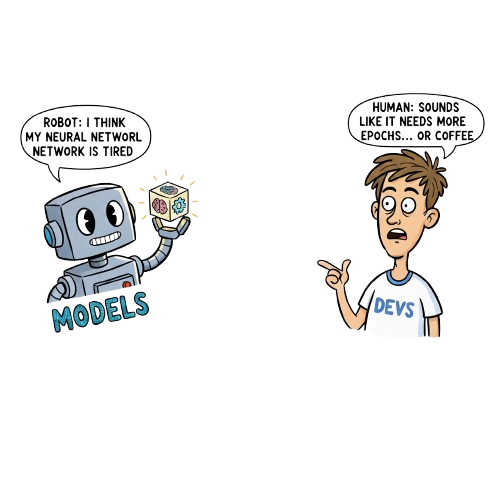

  

<h1>👋 Hey there! I'm Aaditya </h1>

  
  
  
  
  
  

## 💫 About Me

I am a student at **Dr. D. Y. Patil Institute of Engineering, Management And Research**👨‍🎓 
- 🚧 You will always find me working on projects - 🐍 Currently Learning Python at an Advanced Level 
- 🧠 Have Good Knowledge of **Flask | HTML | CSS | Python | JS | React** 
- 🎮 Love To Travel and Play Games

## 🚀 Tech Arsenal

<b>Frontend Development</b>

 

<b>Backend & Databases</b>

 

<b>AI/ML & Other Technologies</b>

 

## 🎯 LeetCode Journey

  

**🔥 Problems Solved: XXX** | **⭐ Consistent Problem Solver**

## 💼 Featured Projects

### 🚁 [Drone Surveillance System with RL](https://github.com/RohanSali/Drone-Surveillance-System)
**Tech Stack:** PyBullet • Gymnasium • Reinforcement Learning • Supervised Learning  
Autonomous drone surveillance leveraging AI and Reinforcement Learning for intelligent navigation, target identification, and real-time decision-making. Reduces human error in surveillance operations with adaptive anomaly detection and crowd monitoring.

🔗 **[View Project](https://github.com/RohanSali/Drone-Surveillance-System)**

---

### 🏥 [MEDILOG - Hospital Management System](https://github.com/aadim112/HM0055_Code200)
**Tech Stack:** React.js • Firebase • Google Gemini • Google Authentication  
Web-based platform streamlining doctor-patient interactions with efficient appointment booking, patient records management, and real-time inventory updates. Features secure data storage and fully responsive design.

🔗 **[View Project](https://github.com/aadim112/HM0055_Code200)**

---

### 🅿️ [RentPar - Smart Parking Solution](https://github.com/aadim112/RentPar)
**Tech Stack:** React.js • Firebase • Mapbox • HereWeGo API • Google Auth  
Intelligent parking space detection and booking system that helps users find free and paid parking near destinations. Uses real-time location tracking and coordinate-based search for optimal parking recommendations.

🔗 **[View Project](https://github.com/aadim112/RentPar)**

## 📜 Certifications

| Certification | Platform | Credential |
|:-------------:|:--------:|:----------:|
| 🎯 **Core Concept of C++** | Devtown | Verified |
| 🌐 **HTML** | Sololearn | CT-OMQ0GWXF |
| 🐍 **Python Basics** | Sololearn | CC-OIOS0SWD |
| ⚡ **Core Concept of JavaScript** | Sololearn | CT-MLNXDENA |
| 💻 **Python Skill Test** | HackerRank | 62C60659914C |
| 📊 **Data Analytics** | Forage (Deloitte) | Verified |
| 🤖 **Data Pre-Processing for ML** | Udemy | UC-83937212-5853 |

## 🏅 LeetCode Badges

  

  

  
  ### "The only way to do great work is to love what you do." - Steve Jobs

  

  

