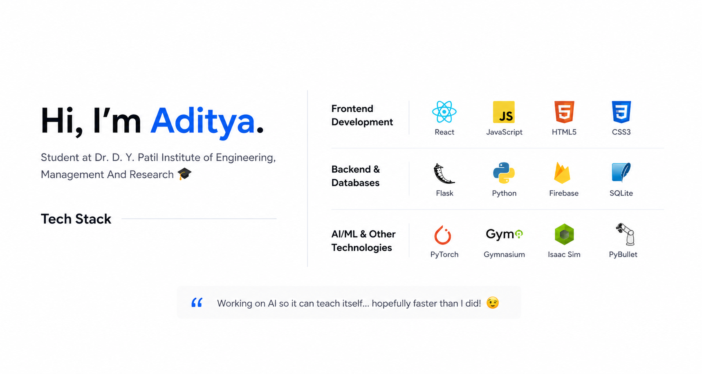

  

  

  
  
  
  
  

  
  
  
  

<h2>Featured Projects </h2>

### [Drone Surveillance System with RL](https://github.com/RohanSali/Drone-Surveillance-System)
**Tech Stack:** PyBullet • Gymnasium • Reinforcement Learning • Supervised Learning  
Autonomous drone surveillance leveraging AI and Reinforcement Learning for intelligent navigation, target identification, and real-time decision-making. Reduces human error in surveillance operations with adaptive anomaly detection and crowd monitoring.

**[View Project](https://github.com/RohanSali/Drone-Surveillance-System)**

---

### [MEDILOG - Hospital Management System](https://github.com/aadim112/HM0055_Code200)
**Tech Stack:** React.js • Firebase • Google Gemini • Google Authentication  
Web-based platform streamlining doctor-patient interactions with efficient appointment booking, patient records management, and real-time inventory updates. Features secure data storage and fully responsive design.

**[View Project](https://github.com/aadim112/HM0055_Code200)**

---

### 🅿️ [RentPar - Smart Parking Solution](https://github.com/aadim112/RentPar)
**Tech Stack:** React.js • Firebase • Mapbox • HereWeGo API • Google Auth  
Intelligent parking space detection and booking system that helps users find free and paid parking near destinations. Uses real-time location tracking and coordinate-based search for optimal parking recommendations.

**[View Project](https://github.com/aadim112/RentPar)**

  

 

*Move fast and break things. Unless you are breaking stuff, you are not moving fast enough. – Mark Zuckerberg* 

