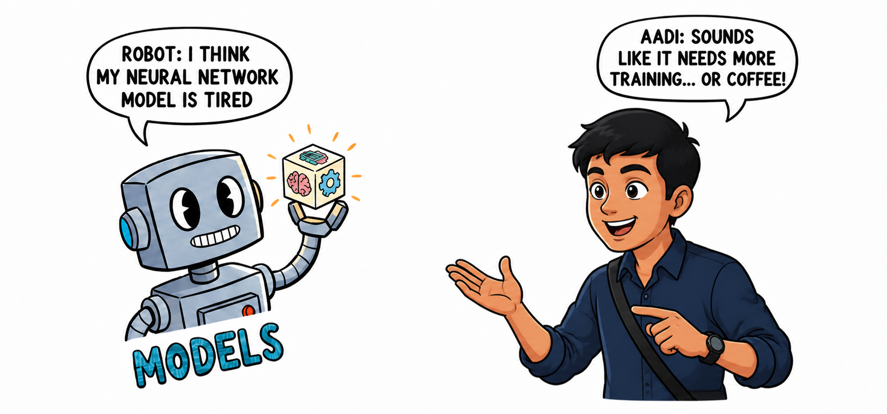
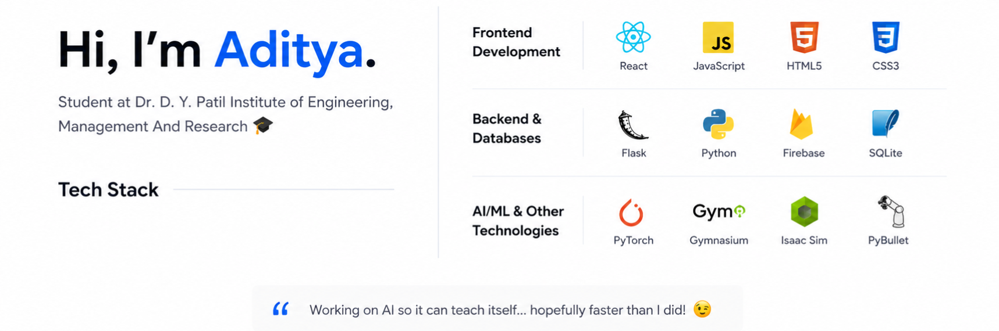

  

  

<h2> Building Is My Loving Language </h2>

  

<h2>What I Believe "What I Am" :)</h2>

I am a Software Engineering student specializing in Artificial Intelligence and Data Science at Dr. D. Y. Patil Institute of Engineering, Management, and Research. My passion lies in exploring new technologies, and I thrive on the excitement of learning and applying them.

Currently, I am deepening my expertise in Machine Learning, with a focus on mastering core concepts and implementing them. My goal is to achieve a solid foundation in Python while gaining hands-on experience through real-world applications.

I have worked on various projects that have enhanced my machine learning skills, where I focused on applying core concepts, experimenting with different approaches, and developing solutions to real-world problems.While web development has been an enjoyable medium for implementing my ideas, I am actively expanding my horizons by exploring diverse Python applications beyond web development. In addition to my technical pursuits, I am currently learning the Japanese language(JLPT N5).

I am enthusiastic about combining my learning with practical experiences, staying committed to growing as a developer and contributing to impactful projects.

  
  
  
  
  

  
  
  
  

  

 

*Move fast and break things. Unless you are breaking stuff, you are not moving fast enough. – Mark Zuckerberg* 

